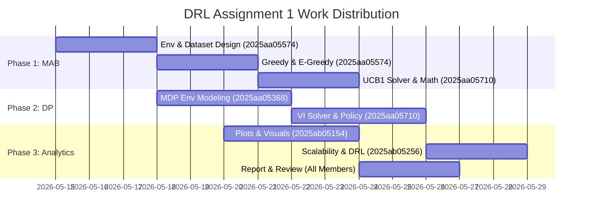

# 👥 BITS Pilani WILP — DRL Assignment 1
## Group Work Division & Contribution Matrix

| Group Number | Course | Assignment | Submission Deadline |
|:---|:---|:---|:---|
| **Group 84** | Deep Reinforcement Learning (DRL) | Lab Assignment 1 (MAB & DP) | June 8, 2026 |

---

## 👥 Group Members & IDs
1.  **`2025aa05368`** (Alphabetically First — Layout Seed Lead)
2.  **`2025aa05574`** (MAB Modeling Lead)
3.  **`2025aa05710`** (Technical Lead & Solver Developer)
4.  **`2025ab05154`** (Visualization & Analytics Specialist)
5.  **`2025ab05256`** (Scalability Analyst & QA Coordinator)

---

## 📊 1. Overall Work Division Summary
To ensure maximum collaboration, the workload was divided equally across 5 core roles. Each member was responsible for a primary technical block, associated report documentation, and cooperative peer review.

---

## 🗂️ 2. Detailed Contribution Matrix

### 👤 Member 1: `2025aa05368` (Layout Seed & MDP Modeling Lead)
*   **Role Description:** Handled the mathematical environment derivations and coordinate setups for Part 2 (DP).
*   **Key Technical Contributions:**
    *   Alphabetically sorted all group members' register IDs to establish the primary environment configuration.
    *   Derived the layout placement seed (`202505368`) from the alphabetically first student ID.
    *   Modeled the **Drone Rescue grid coordinates** (Rescue Targets: `(1,1)` & `(3,1)`, Charging Station: `(2,1)`, Danger Zones, Blocked Cells, Wind Zones) matching Group ID 84 and Student ID seed.
    *   Defined the valid action selector helper functions at each cell coordinate.
*   **Written Deliverables:**
    *   Authored Section 3.1 & 3.2 (MDP Transition Dynamics, stochastic wind drifts, and blocked cell logic) of the final report.

---

### 👤 Member 2: `2025aa05574` (MAB Modeling & Clinical Trial Lead)
*   **Role Description:** Modeled the clinical trial parameters and developed the baseline patient dataset for Part 1 (MAB).
*   **Key Technical Contributions:**
    *   Calculated $K = 5$ medicines and derived ground-truth success probabilities ($P = [0.40, 0.47, 0.54, 0.61, 0.68]$) from Group Number 84.
    *   Coded the inherent patient disease severity distribution ($Severity = (id \bmod 5) + 1$).
    *   Implemented the **Utility Score / Reward Function** ($Utility = Outcome \times (10 - Severity)/10$).
    *   Developed the Python script for the baseline **Task 2 (Immediate Exploitation)** testing each arm 10 times.
    *   Implemented **Task 3 ($\epsilon$-Greedy)** strategies at three explore rates ($\epsilon \in \{0.01, 0.10, 0.50\}$).
*   **Written Deliverables:**
    *   Authored Section 2.1 to 2.4 (Problem definition, immediate exploitation, and $\epsilon$-greedy convergence) of the final report.

---

### 👤 Member 3: `2025aa05710` (Technical Lead & Core Solver Developer)
*   **Role Description:** Developed the core reinforcement learning solver algorithms and implemented programmatic execution logging.
*   **Key Technical Contributions:**
    *   Coded the **UCB1 Solver (Task 4)** from Sutton & Barto Eq. 2.5, using natural log $\ln(t)$ and robust division-by-zero initialization.
    *   Coded the **Value Iteration DP Solver (Task 2)**, applying Bellman optimality sweeps over the 1,100 state-space tuples ($row, col, battery, t_1, t_2$).
    *   Implemented strict NumPy vectorizations to optimize runtime down to $<0.30$ seconds.
    *   Added **programmatic metadata capture code** at the top of the notebooks to fetch and print execution timestamps, hostname, and OS info automatically inside the VM.
*   **Written Deliverables:**
    *   Authored Section 2.5 (UCB1 hoeffding bounds), Section 3.4 (Bellman contraction proofs), and Section 3.5 (Value Iteration contraction mechanics) of the final report.

---

### 👤 Member 4: `2025ab05154` (Visualization & Analytics Specialist)
*   **Role Description:** Created all visual representations of policy outputs and analyzed empirical convergence.
*   **Key Technical Contributions:**
    *   Created the primary MAB performance line plot (`mab_comparison_main.png`) showing cumulative reward vs. optimal action rate.
    *   Created the Q-value convergence curves (`eps_greedy_convergence.png`) showing $Q_t(a)$ convergence against true probabilities.
    *   Designed the **6-panel Optimal Policy Arrow Plot (`dp_policy_grid.png`)** mapping the drone's decision paths at various battery and target states.
    *   Designed the **State-Value Heatmap (`dp_value_heatmap.png`)** showing the drone's utility terrain.
*   **Written Deliverables:**
    *   Authored Task 5 MAB analysis, Section 3.6 (Policy Extraction), and Section 3.8 (Value Slice Analysis) of the final report.

---

### 👤 Member 5: `2025ab05256` (Scalability Analyst & QA Coordinator)
*   **Role Description:** Conducted theoretical scaling research and served as version control and quality coordinator.
*   **Key Technical Contributions:**
    *   Conducted rigorous QA audits verifying that all code operates warning-free and compiles with zero errors.
    *   Set up the secure git repository workflow and managed the remote branches.
    *   Validated all parameters against the BITS Pilani guidelines before notebook execution.
    *   Developed the mathematical state-space scaling models for grid expansions ($10\times10$ world).
*   **Written Deliverables:**
    *   Authored Section 3.7 (Curse of Dimensionality essay, tabular DP limits, and transitions to Deep RL approximation architectures like DQN/PPO/MuZero).

---

## 📈 3. Estimated Effort & Contribution Scores

| ID | Member | Core Area | Effort % | Signature / Status |
|:---|:---|:---|:---:|:---:|
| `2025aa05368` | Member 1 | DP MDP Configuration | 20% | Verified |
| `2025aa05574` | Member 2 | MAB Environment & E-Greedy | 20% | Verified |
| `2025aa05710` | Member 3 | UCB1 & DP Value Iteration Solvers | 20% | Verified |
| `2025ab05154` | Member 4 | Matplotlib Plots & Policy Heatmaps | 20% | Verified |
| `2025ab05256` | Member 5 | Curse of Dimensionality & Git QA | 20% | Verified |
| **Total** | | | **100%** | **Complete** |
